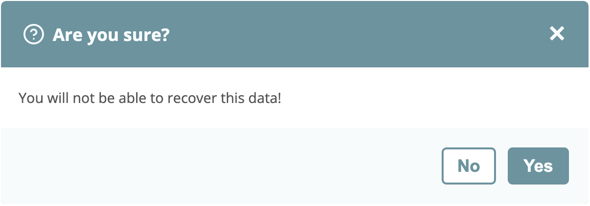
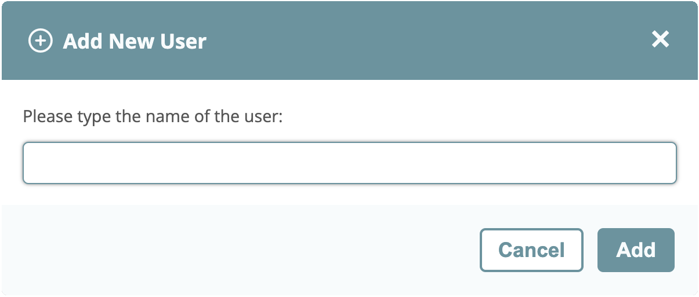

# Custom Popup Boxes - With HTML, CSS and JavaScript

Build custom alert, confirm and prompt popup boxes with HTML, CSS and JavaScript.
All examples uses the HTML dialog element, with animations, icons, export/import declarations and much more.

    

    

    

